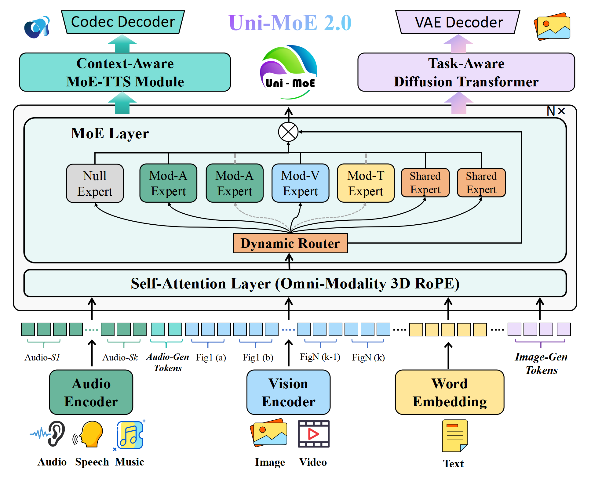
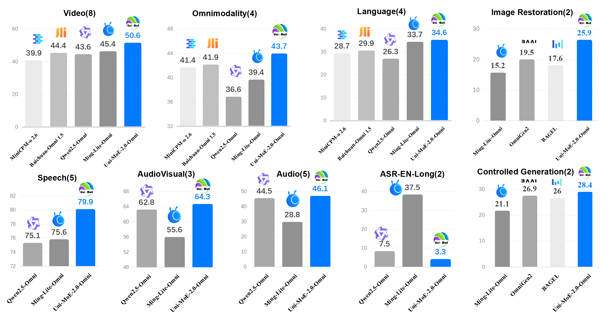

<h1 align="center">Uni-MoE-2.0-Omni: Scaling Language-Centric Omnimodal Large Model with Advanced MoE, Training and Data</h1>

<div align="center" style="display: flex; justify-content: center; margin-top: 10px;">
  <a href="https://idealistxy.github.io/Uni-MoE-v2.github.io/"></a>
  <a href="https://arxiv.org/abs/2511.12609"></a>
  <a href="https://huggingface.co/collections/HIT-TMG/lychee-uni-moe-20"></a>
</div>


<p>
    <strong>Uni-MoE-2.0-Omni</strong> is a significant evolution of our original Uni-MoE 1.0 model. The previous version explored the use of Mixture of Experts (MoE) for unified multimodal language modeling, demonstrating its effectiveness across diverse modalities such as text, audio, speech, images, and video.
</p>
<p>
    Uni-MoE-2.0-Omni builds on this foundation, rebuilt from scratch on the more powerful Qwen2.5-7B core, and introduces key architectural and training paradigms. Major improvements include a unified speech encoder, context-aware MoE-TTS, deep cross-modal alignment via 3D RoPE, and advanced MoE fusion strategies with a refined training recipe.
</p>


## Architecture


<div align="center">
<strong>Fig. 1</strong> The Uni-MoE-2.0-Omni architecture processes multimodal data through a unified tokenization strategy. Audio is tokenized in 30-second clips, augmented with generation tokens for voice control in the context-aware MoE-TTS module, while images are encoded using a sliding window technique. Image Generation Tokens bridge the model to a task-aware diffusion transformer for end-to-end generation tasks. The model's comprehension is powered by Omni-Modality 3D RoPE, which aligns inputs across time, and a sophisticated MoE layer. This MoE layer dynamically routes information using diverse experts, with stability ensured by null experts (for token skipping) and modality-specific routed experts (A, V, T indicate audio, visual, and textual expert pretrained on corresponding data). In contrast, compact shared experts (only 1/8 size of routed experts) enable efficient cross-modal knowledge transfer.
</div>

## Model Introduction


https://github.com/user-attachments/assets/5e5ca44b-a39f-49bf-afca-78c73b7657ed


## Experimental Results

<div align="center">
<strong>Fig. 2</strong> The performance of Uni-MoE 2.0 and previous SOTA omnimodal large models.
</div>

## Getting Started

### 1. Clone this repository and navigate to the Uni-MoE 2.0 folder
```bash
git clone https://github.com/HITsz-TMG/Uni-MoE.git
cd Uni-MoE-2
```
### 2. Set up environment
Install the evaluation environment according to the requirements.
```bash
conda create -n uni_moe_2 python=3.11
conda activate uni_moe_2
pip install torch==2.5.1 torchaudio==2.5.1 torchvision==0.20.1
pip install -r requirements.txt
pip install flash-attn==2.6.0.post1 --no-build-isolation
pip install clip==1.0@git+https://github.com/openai/CLIP.git@dcba3cb2e2827b402d2701e7e1c7d9fed8a20ef1
```
## Uni-MoE 2.0 Weights
We have released the weights of five versions of Uni-MoE 2.0 on Hugging Face, as shown in below tables.
| Model | Capalicity|
| --------  | -----------|
| [ Uni-MoE 2.0-Omni](https://huggingface.co/HIT-TMG/Uni-MoE-2.0-Omni) | All-modality understanding, speech generation, image generation, image editing, and low-level image processing | 
| [ Uni-MoE 2.0-Base](https://huggingface.co/HIT-TMG/Uni-MoE-2.0-Base) | All-Modality Understanding| 
| [ Uni-MoE 2.0-Thinking](https://huggingface.co/HIT-TMG/Uni-MoE-2.0-Thinking) | Comprehensive long-form omnimodal reasoning capabilities |
| [ Uni-MoE 2.0-Image](https://huggingface.co/HIT-TMG/Uni-MoE-2.0-Image) | High-performance image generation, image editing, and low-level image processing |
| [ Uni-MoE 2.0-TTS](https://huggingface.co/HIT-TMG/Uni-MoE-TTS) | Speech Generation|

## Cookbooks
We are releasing [cookbooks](https://github.com/HITsz-TMG/Uni-MoE/tree/master/Uni-MoE-2/examples) for various capabilities, including multi-image understanding, omni video understanding, audio generation, image editing, and more. Stay tuned!

| Cookbook | Description |
| -------- | ----------- |
| [Image Understanding](examples/cookbook_image.py) | Image Understanding, Multi-Images Understanding |
| [Video Understanding](examples/cookbook_video.py) | Video Understanding, Omni Video Understanding |
| [Audio Tasks](examples/cookbook_audio.py) | Audio Understanding, ASR, TTS, Long ASR/TTS, Speech Chat, Vision+Speech Chat |
| [Visual Generation](examples/cookbook_visual_gen.py) | Image Generation, Image Editing, Controllable Image Generation, Low-level Image Restoration |
| [Visual Reasoning](examples/cookbook_thinking.py) | Long-CoT Visual Reasoning |


## Example Usage
We also provide a simple example on the usage of this repo. 
```python
import torch
from uni_moe.model.processing_qwen2_vl import Qwen2VLProcessor
from uni_moe.model.modeling_out import GrinQwen2VLOutForConditionalGeneration
from uni_moe.qwen_vl_utils import process_mm_info
from uni_moe.model import deepspeed_moe_inference_utils

processor = Qwen2VLProcessor.from_pretrained("HIT-TMG/Uni-MoE-2.0-Omni")

model = GrinQwen2VLOutForConditionalGeneration.from_pretrained("HIT-TMG/Uni-MoE-2.0-Omni", torch_dtype=torch.bfloat16).cuda()

processor.data_args = model.config

messages = [{
    "role": "user", 
    "content": [
            {"type": "text", "text": "<audio>\n<image>\nAnswer the question in the audio."},
            {"type": "audio", "audio": "examples/assets/audio/quick_start.mp3"},
            {"type": "image", "image": "examples/assets/image/quick_start.jpg"}
        ]
}]

texts = processor.apply_chat_template(messages, tokenize=False, add_generation_prompt=True)
texts = texts.replace("<image>","<|vision_start|><|image_pad|><|vision_end|>").replace("<audio>","<|audio_start|><|audio_pad|><|audio_end|>").replace("<video>","<|vision_start|><|video_pad|><|vision_end|>")
image_inputs, video_inputs, audio_inputs = process_mm_info(messages)

inputs = processor(
    text=texts,
    images=image_inputs,
    videos=video_inputs,
    audios=audio_inputs,
    padding=True,
    return_tensors="pt",
)
inputs["input_ids"] = inputs["input_ids"].unsqueeze(0)

inputs = inputs.to(device=model.device)

output_ids = model.generate(
    **inputs,
    use_cache=True,
    pad_token_id=processor.tokenizer.eos_token_id,
    max_new_tokens=4096,
    temperature=1.0,
    do_sample=True
)

text = processor.batch_decode(output_ids[:, inputs["input_ids"].shape[-1]:], skip_special_tokens=True)[0]
print(text)

```

## Evaluation

We recommend using our modified version of **[lmms-eval](https://github.com/EvolvingLMMs-Lab/lmms-eval/tree/main)** to evaluate the model across various benchmarks.

### Installation

First, install the customized `lmms-eval` included in this repository:

```shell
cd evaluation/lmms-eval
pip install -e ".[all]"
```

### Usage

Before running evaluations, make sure to configure your **HF token**, as required by `lmms-eval`.

For **video-related tasks**, you can set `use_audio_in_video=True` in `model_args` to include audio information as part of the model input.

To evaluate the **thinking-enabled version** of the model, set `think_mode=True`  in `model_args` to ensure reasoning mode is correctly activated.

Below is an example evaluation script:

```shell
export HF_HUB_ENABLE_HF_TRANSFER="1"
export HF_ENDPOINT=https://hf-mirror.com
export HF_TOKEN="your_hf_token"
export DECORD_EOF_RETRY_MAX=40960

python -m lmms_eval \
    --model uni_moe_2_omni \
    --model_args pretrained=HIT-TMG/Uni-MoE-2.0-Omni \
    --tasks ai2d \
    --batch_size 1 \
    --output_path eval/eval_results \
    --log_samples
```

## SFT Training
We provide two scripts for fine-tuning Uni-MoE 2.0: LoRA and Full Fine-Tuning.
We strongly recommend using LoRA for fine-tuning, as it allows single-GPU fine-tuning without using expert parallelism.
For Full fine-tuning, with zero2 and using four expert parallelism, our tests indicate that at least four nodes with 32 × 80GB GPUs are required to training.

```shell
# LoRA FineTuning
bash training_scripts/finetune_moe_lora.sh

# Full FineTuning (multi-nodes on Slurm clusters)
sbatch training_scripts/finetune_moe_slurm.sh
```

For the training data, we support both JSON and Parquet formats. We have provided [example](demo_100.json) in JSON format.


After training is complete, you need to use the following code to merge the LoRA weights / Expert Parallel weights.


```shell
python training_scripts/model_merge.py --model_path path_to_origin_model(HIT-TMG/Uni-MoE-2.0-Omni) --ckpt_path path_to_your_ckpt(xxx/checkpoint-xxx) --lora_enable True/False --save_path path_to_save
```


## Citation
Please cite the repo if you use the model or code in this repo.
```

@ARTICLE{li_unimoe2omni,
  author={Li, Yunxin and Chen Xinyu and Jiang, Shenyuan and Shi, Haoyuan and Liu, Zhenyu and Zhang, Xuanyu and Deng, Nanhao and Xu, Zhenran and Ma, Yicheng and Zhang, Meishan and Hu, Baotian and Zhang, Min},
  journal={arXiv preprint arXiv:2511.12609}, 
  title={Uni-MoE-2.0-Omni: Scaling Language-Centric Omnimodal Large Model with Advanced MoE, Training and Data}, 
  year={2025},
 }


```
