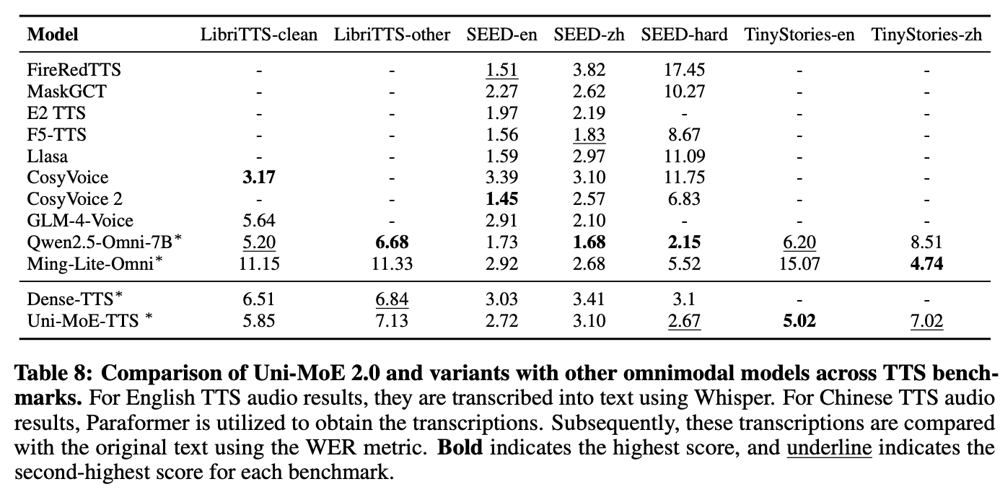

<h1 align="center">Uni-MoE-TTS: Text to Speech model for Uni-MoE 2.0</h1>

<div align="center" style="display: flex; justify-content: center; margin-top: 10px;">
  <a href="https://huggingface.co/HIT-TMG/Uni-MoE-TTS"></a>
</div>


<p>
    <strong>Uni-MoE-TTS</strong> is the audio output module of the Uni-MoE 2.0 version. It adopts a multi-layer Transformers architecture with mixture of experts(from text tokens to audio tokens) and an innovative context-aware & long-audio chunking synthesis mechanism, enabling high-quality long-audio synthesis. Currently, it supports three distinct timbres and two languages (Chinese and English), while the function of text-controlled speech style is still in the experimental stage.
</p>

<p align="center">
  
</p>

<p align="center">
    <video src="https://github.com/user-attachments/assets/914e31d8-bcb5-434b-9df6-47756ba79905" width="100%" style="margin: 0; padding: 0;" controls>
      抱歉，您的浏览器不支持内嵌视频。
    </video>
</p>

## Installation
The following instructions are for Linux installation.

### 1. Clone this repository and navigate to the UniMoE Audio folder
```bash
git clone https://github.com/HITsz-TMG/Uni-MoE/tree/master/Uni-MoE-TTS
cd Uni-MoE-TTS 
```

### 2. Set up environment
We recommend using conda to install the environment.
```bash
conda env create -n unimoe-tts python=3.11
conda activate unimoe-tts
pip install -r requirements.txt
```

## UniMoE TTS Weights
`All weights` should be downloaded to ensure use. After downloading all of them, organize the weights as follows in '/path/to/Model/Uni-MoE-TTS' folder:
```bash
Uni-MoE-TTS
├── qwen_pp
│   ├── config.json
│   ├── configuration.json
│   ├── generation_config.json
│   ├── preprocessor_config.json
│   ├── tokenizer_config.json
│   ├── tokenizer.json
│   └── vocab.json
├── speech_gen_ep2.bin
├── training
│   ├── experts
│   │   ├── expert_num_0.bin
│   │   ├── expert_num_1.bin
│   │   ├── expert_num_2.bin
│   │   ├── expert_num_3.bin
│   │   └── expert_num.bin
│   └── from_model
│       └── speech_generator.bin
├── wavtokenizer_large_unify_600_24k.ckpt
└── wavtokenizer_smalldata_frame40_3s_nq1_code4096_dim512_kmeans200_attn.yaml
```

All the weights can be downloaded from the following link: [Uni-MoE-TTS](https://huggingface.co/HIT-TMG/Uni-MoE-TTS)
Qwen2.5-0.5B-Instruct is needed if you need to train our model, download Qwen2.5-0.5B-Instruct from this link: [Qwen2.5-0.5B-Instruct](https://huggingface.co/Qwen/Qwen2.5-0.5B)

## How to train 

Make sure that all the weights are downloaded and the environment is set correctly, especially for the base model.

Our training data are constructed using a TTS model. The speech audios are converted into codec tokens via Wavtokenizer, while the texts are transformed into text tokens using the Qwen2.5-VL-3B-Instruct tokenizer. Examples of the training data can be found in the `/train/training_data/` directory. If you wish to train your own Uni-MoE-TTS model, you may construct your own dataset, ensuring that its format matches the training data examples provided in `/train/training_data/`.

If you want to train Uni-MoE-TTS, follow the examples in `/train/train.sh`, please change the `path/to/Model/Uni-MoE-TTS` and `path/to/Uni-MoE/Uni-MoE-TTS` in the script to the path of your downloaded model and code.

The training command is:
```bash
deepspeed --include localhost:0\
    --master_addr $MASTER_ADDR --master_port $MASTER_PORT \
    uni_omni/train/train_mem_speech.py \
    --deepspeed ./scripts/zero2.json \
    --model_name_or_path path/to/Qwen2.5-0.5B-Instruct \
    --version v1 \
    --data_path path/to/Uni-MoE/Uni-MoE-TTS/train/training_data/training_smp_1000.json \
    --mm_use_im_start_end False \
    --mm_use_im_patch_token False \
    --bf16 True \
    --output_dir output \
    --num_train_epochs 4 \
    --per_device_train_batch_size 1 \
    --per_device_eval_batch_size 2 \
    --gradient_accumulation_steps 8 \
    --save_strategy "steps" \
    --save_steps 1000 \
    --save_total_limit 3 \
    --learning_rate 8e-5 \
    --weight_decay 0. \
    --warmup_ratio 0.0 \
    --lr_scheduler_type "cosine" \
    --logging_steps 1 \
    --tf32 True \
    --model_max_length 2100 \
    --gradient_checkpointing False \
    --dataloader_num_workers 10 \
    --lazy_preprocess True \
    --report_to tensorboard \
    --tune_speech_generator True\
    --tune_speech_generator_only True\
    --speech_generator_type ar_ori_v2_new \
    --load_weight_from_qwen path/to/Model/Uni-MoE-TTS/from_model/speech_gen_ep2.bin \
    --expert_dir path/to/Model/Uni-MoE-TTS/training/experts \
    --codes_folder path/to/Uni-MoE/Uni-MoE-TTS/train \
    --transformer_num_blocks 24\
    --audio_mode "tts_pretrain"\
    --group_by_modality_length True
```

## How to infer 
First of all, make sure the environment is ready.

```bash
conda activate unimoe-tts
cd path/to/Uni-MoE/Uni-MoE-TTS/inference
```

If you want to infer with python command, follow the examples in `/inference/infer.sh`, please change the `path/to/Model/Uni-MoE-TTS` and `path/to/Uni-MoE/Uni-MoE-TTS` in the script to the path of your downloaded code and model.
Change `infer.sh` to generate your own speech.
```bash
# Normal TTS with three different voices
# Chinese
python infer.py \
        --model_dir "path/to/Model/Uni-MoE-TTS" \
        --wav_path "test_zh.wav" \
        --text "您好，欢迎您使用我们的Uni MOE文本转语音模型！" \
        --speaker "Brian" \
        --language "Chinese"

# English
python infer.py \
        --model_dir "path/to/Model/Uni-MoE-TTS" \
        --wav_path "test_en.wav" \
        --text "Greetings, Welcome to try out our Uni MOE Text to Speech model!" \
        --speaker "Jenny" \
        --language "English"

# Long speech TTS
python infer.py \
        --model_dir "path/to/Model/Uni-MoE-TTS" \
        --wav_path "test_zh_long.wav" \
        --text "冰淇淋！你这个甜蜜的天使，你在夏天里如影随形。你的奶油那么香甜，像是清晨的阳光洒在冰凉的麦田上。我看着你，心里充满了好奇和欣喜。然而有一天，我被送到了一个陌生的地方。那个地方像一个大冰箱，里面充满了冰冷的东西。那些东西都是我从未见过的，包括讲座、睡觉和形容词“大”。那个地方看起来冷酷无情，就像冰淇淋一样，让人感到害怕。我在那里待了一段时间，每天都在学习各种奇怪的知识。我甚至开始睡觉，变成了一个睡眠机器。我用我的理论知识来对抗这个世界，试图让它变得更好。但每当我试图醒来时，都会发现我已经忘记了刚刚发生的一切。终于有一天，我决定反抗这个疯狂的世界。我拿出了我的“夜班”，开始了我的攻击。我用我的名词“讲座”来解释这个世界，我用我的动词“睡觉”来支持我的论点，我用我的形容词“大”来强调我的力量。然后，我启动了我的主题——冰淇淋的力量。冰淇淋融化了我所有的抵抗，它让我失去了理智，忘记了自己原本的目标。我继续睡着，直到被一场暴雨唤醒。那天晚上，我和冰淇淋一起吃饭。我们坐在外面的大厅里，享受着冰淇淋的甜美。我看着冰淇淋，心中充满了感激。我知道，这就是我要的生活，充满挑战，充满甜蜜。冰淇淋，你是我在这个世界里的救星。我会记住你带给我的一切，我会继续前进，直到找到属于自己的天堂。" \
        --speaker "Brian" \
        --language "Chinese"

# English Stlye control TTS (experimental)
python infer.py \
        --model_dir "path/to/Model/Uni-MoE-TTS" \
        --wav_path "test_style1.wav" \
        --text "It was not absolutely ebony and gold, but it was japan, black and yellow japan of the handsomest kind." \
        --prompt "In a natural tone, a normal-pitched young female with normal pitch and volume describes the topic of selected audiobooks as alluding to a situation in which something is not completely black, at a normal speed." \
        --language "English"
        

# Chinese Stlye control TTS (experimental)
python infer.py \
        --model_dir "path/to/Model/Uni-MoE-TTS" \
        --wav_path "test_style2.wav" \
        --text "真正的改变就不会发生。" \
        --prompt "少女声音低沉，情绪中充满了伤感和难过，用低音调，正常音高缓慢地说。" \
        --language "Chinese"
```

If you want to infer with python script, before running the `inference/infer_py.py`, please change the `path/to/Model/Uni-MoE-TTS` in the script to the path of your downloaded model.

Change `infer_py.py` to generate your own speech.
```python
# Normal TTS with three different voices
# chinese
infer_tts(model=model,
            processor=processor,
            wavtokenizer=wavtokenizer,
            wavpath="test_zh.wav",
            tts_text="您好，欢迎您使用我们的Uni MOE文本转语音模型！",
            prompt=None,
            speaker="Brian", # 中文TTS可以使用Brian和Xiaoxiao的音色
            Language="Chinese"
            )
# Engllish
infer_tts(model=model,
            processor=processor,
            wavtokenizer=wavtokenizer,
            wavpath="test_en.wav",
            tts_text="Greetings, Welcome to try out our Uni MOE Text to Speech model!",
            prompt=None,
            speaker="Jenny", # English TTS can be performed using Brian's or Jenny's voice
            Language="English"
            )

# Long speech TTS
infer_tts(model=model,
            processor=processor,
            wavtokenizer=wavtokenizer,
            wavpath="test_zh_long.wav",
            tts_text="冰淇淋！你这个甜蜜的天使，你在夏天里如影随形。你的奶油那么香甜，像是清晨的阳光洒在冰凉的麦田上。我看着你，心里充满了好奇和欣喜。然而有一天，我被送到了一个陌生的地方。那个地方像一个大冰箱，里面充满了冰冷的东西。那些东西都是我从未见过的，包括讲座、睡觉和形容词“大”。那个地方看起来冷酷无情，就像冰淇淋一样，让人感到害怕。我在那里待了一段时间，每天都在学习各种奇怪的知识。我甚至开始睡觉，变成了一个睡眠机器。我用我的理论知识来对抗这个世界，试图让它变得更好。但每当我试图醒来时，都会发现我已经忘记了刚刚发生的一切。终于有一天，我决定反抗这个疯狂的世界。我拿出了我的“夜班”，开始了我的攻击。我用我的名词“讲座”来解释这个世界，我用我的动词“睡觉”来支持我的论点，我用我的形容词“大”来强调我的力量。然后，我启动了我的主题——冰淇淋的力量。冰淇淋融化了我所有的抵抗，它让我失去了理智，忘记了自己原本的目标。我继续睡着，直到被一场暴雨唤醒。那天晚上，我和冰淇淋一起吃饭。我们坐在外面的大厅里，享受着冰淇淋的甜美。我看着冰淇淋，心中充满了感激。我知道，这就是我要的生活，充满挑战，充满甜蜜。冰淇淋，你是我在这个世界里的救星。我会记住你带给我的一切，我会继续前进，直到找到属于自己的天堂。",
            prompt=None,
            Language="Chinese"
            )

# Stlye control TTS (experimental)
infer_tts(model=model,
            processor=processor,
            wavtokenizer=wavtokenizer,
            wavpath="test_style1.wav",
            tts_text="It was not absolutely ebony and gold, but it was japan, black and yellow japan of the handsomest kind.",
            prompt="In a natural tone, a normal-pitched young female with normal pitch and volume describes the topic of selected audiobooks as alluding to a situation in which something is not completely black, at a normal speed.",
            Language="English"
            )

infer_tts(model=model,
            processor=processor,
            wavtokenizer=wavtokenizer,
            wavpath="test_style2.wav",
            tts_text="真正的改变就不会发生。",
            prompt="少女声音低沉，情绪中充满了伤感和难过，用低音调，正常音高缓慢地说。",
            Language="Chinese"
            )
```

## Citation

```
Please cite the repo if you use the model or code in this repo.
uni-moe 2.0

```

